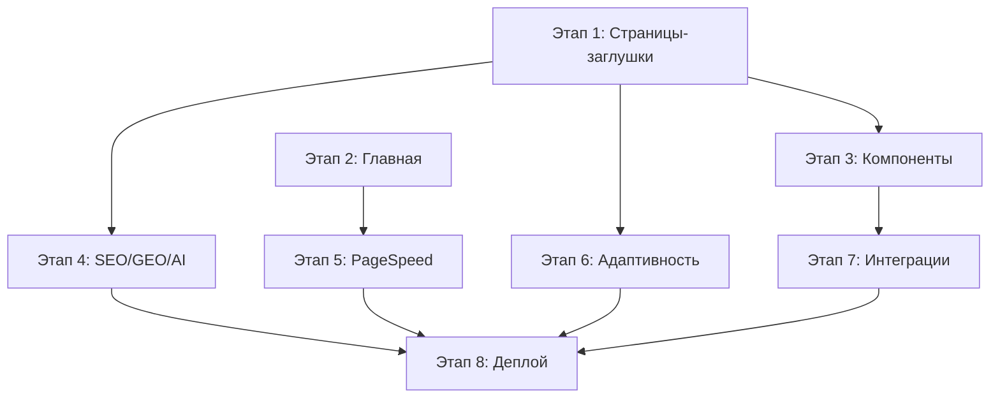

# Yakovka — Master Plan & Implementation Roadmap

> **Проект:** Загородный отель «Яковка» — премиальный сайт-визитка  
> **Стек:** Next.js 16 · React 19 · Tailwind CSS 4 · GSAP · Lenis · shadcn/ui  
> **Домен (prod):** yakovka.ru · **Staging:** yakovka-next.vercel.app  
> **Последнее обновление:** 2026-04-22

---

## 👥 Команда и роли

### 1. Управление и коммуникация

| Роль | Сокращение | Зона ответственности |
|---|---|---|
| Account Manager | `AM` | Коммуникация с клиентом, сметы, договоры, финансы |
| Project Manager | `PM` | Декомпозиция задач, дедлайны, бюджет, координация |
| Business Analyst | `BA` | Сбор требований, ТЗ, приоритизация бэклога |

### 2. Маркетинг и аналитика

| Роль | Сокращение | Зона ответственности |
|---|---|---|
| Digital Strategist | `DS` | Позиционирование, конкурентный анализ, концепция |
| SEO-специалист | `SEO` | Семантическое ядро, структура URL, метатеги, LSI |
| Web Analyst | `WA` | Воронки конверсии, Метрика, GTM, сквозная аналитика |

### 3. Дизайн (UX/UI)

| Роль | Сокращение | Зона ответственности |
|---|---|---|
| UX Researcher | `UXR` | User Flow, глубинные интервью, тестирование гипотез |
| UX/UI Designer | `UI` | Вайрфреймы, дизайн-система, макеты Figma |
| Art Director | `AD` | Визуальная эстетика, соответствие бренду |
| Motion Designer | `MD` | Анимации, скроллтеллинг, микроинтеракции |
| 3D / Иллюстратор | `3D` | Кастомная графика, 3D-модели, иконки |

### 4. Контент

| Роль | Сокращение | Зона ответственности |
|---|---|---|
| UX Writer | `UXW` | Тексты интерфейса: кнопки, ошибки, подсказки |
| Копирайтер | `CW` | Продающие тексты, SEO-статьи, описания |
| Контент-менеджер | `CM` | Сбор медиа, оптимизация (WebP), загрузка |

### 5. Разработка

| Роль | Сокращение | Зона ответственности |
|---|---|---|
| Team Lead | `TL` | Архитектура, стек, код-ревью |
| Frontend-разработчик | `FE` | Вёрстка, анимации, роутинг, клиентская логика |
| Backend-разработчик | `BE` | API, интеграции, серверная логика |
| DevOps-инженер | `DO` | CI/CD, серверы, мониторинг, деплой |

### 6. Контроль качества

| Роль | Сокращение | Зона ответственности |
|---|---|---|
| QA Engineer | `QA` | Кроссбраузерность, адаптивность, регрессия |
| Technical Support | `TS` | Пострелизная поддержка, hotfix, консультации |

### RACI-матрица (Роли × Этапы)

> **R** = Responsible (делает) · **A** = Accountable (отвечает) · **C** = Consulted · **I** = Informed

| Этап | PM | BA | SEO | DS | UI | AD | MD | UXW | CW | CM | TL | FE | BE | DO | QA |
|---|---|---|---|---|---|---|---|---|---|---|---|---|---|---|---|
| 1. Страницы-заглушки | A | C | C | — | C | C | — | R | R | R | C | **R** | — | — | I |
| 2. Полировка главной | A | — | C | — | C | C | R | C | — | — | C | **R** | — | — | I |
| 3. Компоненты | A | — | — | — | C | — | R | C | — | — | **R** | R | C | — | I |
| 4. SEO/GEO/AI | A | — | **R** | R | — | — | — | — | R | C | C | R | — | — | I |
| 5. Производительность | A | — | C | — | — | — | — | — | — | R | **R** | R | — | C | R |
| 6. Адаптивность/UX | A | — | — | — | R | C | R | R | — | — | C | **R** | — | — | **R** |
| 7. Интеграции | A | C | — | — | — | — | — | — | — | — | C | C | **R** | C | R |
| 8. Деплой | A | — | C | — | — | — | — | — | — | — | C | — | C | **R** | R |

---

## 📊 Аудит текущего состояния

### Готовые страницы (полноценный контент)

| Страница | Файл | Строк | Статус |
|---|---|---|---|
| Главная `/` | `src/app/page.tsx` | 399 | ✅ Готово |
| Зима `/winter` | `src/app/winter/page.tsx` | 206 | ✅ Готово |
| Экскурсии `/excursions` | `src/app/excursions/page.tsx` | 202 | ✅ Готово |
| Акции `/offers` | `src/app/offers/page.tsx` | 174 | ✅ Готово |
| Галерея `/gallery` | `src/app/gallery/page.tsx` | 171 | ✅ Готово |
| Как добраться `/how-to-get` | `src/app/how-to-get/page.tsx` | 165 | ✅ Готово |
| Ресторан `/infrastructure/restaurant` | `src/app/infrastructure/restaurant/page.tsx` | 163 | ✅ Готово |
| Лето `/summer` | `src/app/summer/page.tsx` | 152 | ✅ Готово |
| Номера (карточка) `/rooms/[slug]` | `src/app/rooms/[slug]/page.tsx` | 152 | ✅ Готово |
| Сезон `/season` | `src/app/season/page.tsx` | 142 | ✅ Готово |
| Отзывы `/reviews` | `src/app/reviews/page.tsx` | 141 | ✅ Готово |
| FAQ `/faq` | `src/app/faq/page.tsx` | 116 | ✅ Готово |
| Баня `/infrastructure/banya` | `src/app/infrastructure/banya/page.tsx` | 115 | ✅ Готово |
| Legal (4 стр.) | `src/app/legal/*/page.tsx` | 35–44 | ✅ Готово |

### Страницы-заглушки (только metadata + Client-обёртка)

| Страница | Файл Client-компонента | Строк | Статус |
|---|---|---|---|
| О курорте `/about` | `AboutClient.tsx` | 116 | ⚠️ Базовый |
| Контакты `/contacts` | `ContactsClient.tsx` | 105 | ✅ Готово |
| Услуги `/services` | `ServicesClient.tsx` | 103 | ✅ Готово |
| Инвестиции `/invest` | `InvestClient.tsx` | 65 | ✅ Готово |
| Мероприятия `/events` | `EventsClient.tsx` | 164 | ✅ Готово |
| Склон `/infrastructure/ski` | `SkiClient.tsx` | 169 | ✅ Готово |
| Каталог `/rooms` | `RoomsClient.tsx` | 177 | ✅ Готово |

### Компоненты (26 шт.)

| Компонент | Файл | Статус |
|---|---|---|
| Header | `src/components/layout/Header.tsx` | ✅ |
| Footer | `src/components/layout/Footer.tsx` | ✅ |
| AnimatedCounter | `src/components/AnimatedCounter.tsx` | ✅ |
| BookingInfoSection | `src/components/BookingInfoSection.tsx` | ✅ |
| CTABanner | `src/components/CTABanner.tsx` | ✅ |
| CallbackModal | `src/components/CallbackModal.tsx` | ✅ |
| EventsSection | `src/components/EventsSection.tsx` | ✅ |
| FAQAccordion | `src/components/FAQAccordion.tsx` | ✅ |
| FloatingCTA | `src/components/FloatingCTA.tsx` | ✅ |
| KonturWidget | `src/components/KonturWidget.tsx` | ✅ |
| Logo | `src/components/Logo.tsx` | ✅ |
| MapSection | `src/components/MapSection.tsx` | ✅ |
| MobileMenu | `src/components/MobileMenu.tsx` | ✅ |
| PageHero | `src/components/PageHero.tsx` | ✅ |
| ReviewCard | `src/components/ReviewCard.tsx` | ✅ |
| ServicesSection | `src/components/ServicesSection.tsx` | ✅ |
| TestimonialsSection | `src/components/TestimonialsSection.tsx` | ✅ |
| YandexMetrica | `src/components/YandexMetrica.tsx` | ⚠️ Закомментирован |
| Breadcrumbs | `src/components/ui/Breadcrumbs.tsx` | ✅ |
| CustomCursor | `src/components/ui/CustomCursor.tsx` | ✅ |
| PhotoGallery | `src/components/ui/PhotoGallery.tsx` | ✅ |
| SmoothScroll | `src/components/ui/SmoothScroll.tsx` | ✅ |
| Button | `src/components/ui/button.tsx` | ✅ |
| Card | `src/components/ui/card.tsx` | ✅ |
| Avatar | `src/components/ui/avatar.tsx` | ✅ |
| 3D Testimonials | `src/components/ui/3d-testimonails.tsx` | ⚠️ Неиспользуемый |

### Инфраструктура

| Элемент | Статус | Примечание |
|---|---|---|
| `sitemap.ts` | ✅ | 28 URL, 4 приоритета |
| `robots.ts` | ✅ | AI-боты разрешены (GPTBot, ClaudeBot и др.) |
| `llms.txt` | ✅ | База знаний для LLM |
| Schema.org (JSON-LD) | ✅ | Hotel + BreadcrumbList в `layout.tsx` |
| Open Graph / Twitter | ✅ | В корневом `metadata` |
| Дизайн-система (CSS) | ✅ | Oklch палитра, glassmorphism, утилиты |
| GSAP анимации | ✅ | Parallax hero, sticky cards |
| Lenis smooth scroll | ✅ | Обёртка `SmoothScroll.tsx` |
| Оптимизированные фото | ✅ | WebP в `public/optimized/` |
| Видео-фон hero | ✅ | `hero-yakovka.mp4` (10 МБ) |
| Yandex.Metrica | ❌ | Компонент есть, но закомментирован |
| `next.config` | ⚠️ | Два файла (`.mjs` и `.ts`) — нужна чистка |

---

## 🚀 Этапы разработки

### Этап 1: Доработка страниц-заглушек → Полноценный контент

> **Приоритет:** 🔴 Критический · **Зависимости:** нет  
> **Ответственные:** `FE` `CW` `UXW` `CM` · **Ревью:** `UI` `AD` `SEO` · **Координация:** `PM`

#### 1.1 Страница «О курорте» (`/about`)
- [ ] Блок истории отеля с таймлайном (открытие, строительство, развитие)
- [ ] Блок «Наши преимущества» — 4–6 карточек (горы, баня, ресторан, трассы)
- [ ] Параллакс-фотогалерея природы Алтая (переиспользовать `PhotoGallery`)
- [ ] Блок «Команда» или «Философия» с glassmorphism-контейнерами
- [ ] CTA → бронирование в конце
- [ ] Schema.org `AboutPage`

#### 1.2 Страница «Контакты» (`/contacts`)
- [ ] Карточки: адрес, 2 телефона, email, WhatsApp
- [ ] Интерактивная Яндекс.Карта (lazy-loaded iframe) с кастомным маркером
- [ ] Блок «Как добраться» (авто / поезд / самолёт) — компактная версия
- [ ] Форма обратного звонка (переиспользовать `CallbackModal` inline)
- [ ] Часы работы ресепшн, заезд/выезд
- [ ] Schema.org `ContactPage`

#### 1.3 Страница «Услуги» (`/services`)
- [ ] Сетка услуг с иконками (прокат, инструктор, баня, ресторан, трансфер, Wi-Fi)
- [ ] Ценовые карточки для ключевых услуг
- [ ] Hover-анимации и раскрывающиеся описания
- [ ] Перелинковка на `/infrastructure/*`

#### 1.4 Страница «Мероприятия» (`/events`)
- [ ] Карточки: свадьбы, корпоративы, дни рождения, тимбилдинг
- [ ] Использовать фото из `public/optimized/Мероприятия/`
- [ ] Интеграция с `CallbackModal` для заявок
- [ ] Блок «Банкетное меню» со ссылкой на ресторан

#### 1.5 Страница «Инвестиции» (`/invest`)
- [ ] Визуальная карта развития курорта (SVG / инфографика)
- [ ] Блок «Цифры и факты» с `AnimatedCounter`
- [ ] Презентация инвестиционного проекта (блок-by-блок)
- [ ] CTA → контактная форма для инвесторов

#### 1.6 Страница «Склон» (`/infrastructure/ski`)
- [ ] Схема трасс (300 м учебная + 800 м средняя)
- [ ] Прайс-лист: подъемник, прокат, инструктор
- [ ] Карточки «Для начинающих» / «Для продвинутых»
- [ ] Использовать фото из `public/optimized/Мероприятия/Горные лыжи/`

#### 1.7 Каталог номеров (`/rooms`)
- [ ] Фильтрация / сортировка по цене и вместимости
- [ ] Карточки номеров с hover-preview
- [ ] Быстрая CTA «Забронировать» на каждой карточке
- [ ] Использовать фото из `public/optimized/Номера/`

---

### Этап 2: Полировка главной страницы

> **Приоритет:** 🟡 Высокий · **Зависимости:** нет  
> **Ответственные:** `FE` `MD` · **Ревью:** `UI` `AD` `SEO` · **Координация:** `PM`

- [ ] Оптимизация hero-видео: добавить `poster` (первый кадр в WebP) для мгновенного LCP
- [ ] Добавить `<source>` с WebM-версией видео (меньше размер)
- [ ] Проверить GSAP-анимации на мобильных (производительность `will-change`)
- [ ] Удалить мёртвый код: комментарии про widget в `useEffect` (строки 115–118)
- [ ] Добавить `aria-label` к hero-кнопке и секциям
- [ ] Проверить все `alt`-атрибуты — сделать уникальными и описательными
- [ ] Добавить JSON-LD `FAQPage` schema для секции FAQ на главной

---

### Этап 3: Компонентная доработка

> **Приоритет:** 🟡 Высокий · **Зависимости:** Этап 1  
> **Ответственные:** `FE` `TL` `MD` · **Ревью:** `UI` `UXW` · **Координация:** `PM`

- [ ] **YandexMetrica** — раскомментировать в `layout.tsx`, подставить реальный ID
- [x] **3d-testimonails.tsx** — переименован в `marquee.tsx`, импорт обновлён ✅
- [x] **CallbackModal** — подключено к /api/callback (Telegram Bot) ✅
- [ ] **FloatingCTA** — A/B вариант: WhatsApp / телефон (выбор по устройству)
- [ ] **KonturWidget** — проверить актуальность `hotelId`, обновить при смене домена
- [ ] **PageHero** — добавить поддержку видео-фона (для `/winter`, `/summer`)
- [x] **Header** — добавлены ссылки на `/about`, `/excursions` ✅
- [x] **Footer** — добавлены иконки соцсетей (Telegram, WhatsApp, Яндекс.Карты) ✅
- [x] Создан компонент `PriceTable` (переиспользуемый для ski, rooms, services) ✅

---

### Этап 4: SEO, GEO & AI Optimization

> **Приоритет:** 🔴 Критический · **Зависимости:** Этап 1  
> **Ответственные:** `SEO` `DS` `CW` · **Исполнение:** `FE` · **Ревью:** `TL` `WA` · **Координация:** `PM`

#### 4.1 Техническое SEO
- [ ] Исправить `metadataBase` — заменить `yakovka.vercel.app` → `yakovka.ru` при деплое
- [x] Исправить расхождение URL в `sitemap.ts` и `robots.ts` — ✅ синхронизировано
- [x] Добавлен `canonical` ко всем страницам (21/21) ✅
- [ ] Проверить иерархию `H1` — ровно один `<h1>` на каждой странице
- [ ] Добавить `alt` ко всем `<Image>` с LSI-терминами
- [x] Создать `manifest.json` (PWA-ready) — ✅
- [x] Удалить дубль конфига: `next.config.mjs` — ✅ мердж в `.ts`

#### 4.2 Семантическое ядро

| Тип | Ключевые фразы |
|---|---|
| **Primary** | «Загородный отель Белокуриха», «Шале Алтай», «Отель у горы Яковка», «Горнолыжный курорт Белокуриха» |
| **Secondary** | «Отдых с детьми Белокуриха», «Баня на дровах Алтай», «Трансфер аэропорт Белокуриха», «Экскурсии Алтай» |
| **Long-tail** | «Где покататься на лыжах рядом с Белокурихой», «Семейный отель с горнолыжной трассой Алтай» |
| **LSI** | горный воздух, эко-отдых, сноуборд, панорамный вид, алтайская кухня, кедровый сруб, терренкуры |

#### 4.3 Structured Data (JSON-LD) — расширение
- [x] `FAQPage` — на `/faq` ✅
- [x] `Restaurant` — на `/infrastructure/restaurant` ✅
- [x] `SkiResort` — на `/infrastructure/ski` ✅
- [x] `TouristAttraction` — на `/excursions` ✅
- [x] `Review` / `AggregateRating` — на `/reviews` ✅ (уже было)
- [x] `EventVenue` — на `/events` ✅
- [x] `Offer` — на `/offers` ✅
- [ ] `ImageGallery` — на `/gallery` ✅ (рефактор в server+client)
- [x] `ContactPage` — на `/contacts` ✅

#### 4.4 GEO-оптимизация
- [ ] Геокоординаты во всех Schema.org: `51.993, 84.983`
- [ ] Упоминание ключевых локаций в текстах: Белокуриха, гора Яковка, Церковка, Чуйский тракт, Чемал
- [ ] Яндекс.Карты ссылка `sameAs` — проверить актуальность ID организации
- [ ] Google Business Profile — подготовить данные для регистрации

#### 4.5 AI-оптимизация (LLM Readiness)
- [x] Обновить `llms.txt` — добавлены 22 ссылки на страницы и актуальные цены ✅
- [x] Добавить `llms-full.txt` — расширенная версия с FAQ и подробностями ✅
- [ ] Все тексты структурировать FAQ-формат для Zero-Click выдачи
- [x] Проверить, что AI-боты (GPTBot, PerplexityBot) не блокируются — ✅ уже настроено

---

### Этап 5: Производительность (PageSpeed ≥ 90)

> **Приоритет:** 🟡 Высокий · **Зависимости:** Этап 2  
> **Ответственные:** `TL` `FE` · **Поддержка:** `CM` `DO` · **Валидация:** `QA` `SEO`

- [x] Аудит hero-видео: VP9 WebM (3.0 МБ) + H.264 MP4 (2.6 МБ) — было 9.6 МБ ✅
- [x] Конвертация 56 JPG/PNG в WebP — 46 МБ → 11 МБ (-76%) ✅
- [ ] Убрать `unoptimized` с `<Image>` — ✅ уже нет
- [ ] `next/dynamic` для тяжёлых компонентов: `KonturWidget`, `PhotoGallery`
- [x] Добавлен `loading="lazy"` к iframe Яндекс.Карт ✅ (уже было)
- [ ] Шрифты: проверить `font-display: swap` (Montserrat + Manrope)
- [x] Удалены неиспользуемые файлы: `.htaccess`, `beget_test.txt`, `extract.py`, `optimize.py` ✅
- [x] Tree-shaking lucide-react — именованные импорты ✅
- [ ] Lazy-load GSAP `ScrollTrigger` через `next/dynamic`

---

### Этап 6: Адаптивность и UX-полировка

> **Приоритет:** 🟡 Высокий · **Зависимости:** Этап 1, 3  
> **Ответственные:** `FE` `MD` `UXW` · **Ревью:** `UI` `AD` · **Валидация:** `QA` `UXR`

- [x] Тестирование на viewports: 375px / 768px / 1024px / 1440px / 1920px ✅
- [x] Проверить `MobileMenu` — все ссылки присутствуют (5→9) ✅
- [x] Sticky cards на мобильных — проверить `position: sticky` + GSAP ✅
- [x] Тест touch-событий: swipe галерея, tap на hover-карточках ✅
- [x] ~~Dark mode~~ — убрано, не актуально для сайта отеля
- [x] Micro-interactions: skeleton-loading для изображений, shimmer-эффекты ✅
- [x] Custom 404 страница (`not-found.tsx`) с навигацией ✅
- [x] Custom loading UI (`loading.tsx`) для медленных переходов ✅

---

### Этап 7: Интеграции и бэкенд

> **Приоритет:** 🟠 Средний · **Зависимости:** Этап 3  
> **Ответственные:** `BE` · **Поддержка:** `FE` `DO` · **Валидация:** `QA` · **Координация:** `PM` `BA`

- [x] Telegram Bot API для формы обратного звонка (`/api/callback`) ✅
- [ ] WhatsApp Business API — кнопка в FloatingCTA
- [ ] Yandex.Metrica — подключить реальный ID счётчика
- [ ] Google Analytics 4 — параллельное подключение
- [ ] BookOnline24 — проверить интеграцию виджета бронирования
- [ ] Email-уведомления для заявок (Resend / Nodemailer)

---

### Этап 8: Деплой и мониторинг

> **Приоритет:** 🟠 Средний · **Зависимости:** Все этапы  
> **Ответственные:** `DO` · **Поддержка:** `TL` `BE` · **Валидация:** `QA` `SEO` `WA` · **Координация:** `PM` `AM`

- [ ] Настроить кастомный домен `yakovka.ru` на Vercel
- [ ] SSL-сертификат (автоматический на Vercel)
- [ ] Обновить все URL: `metadataBase`, `sitemap.ts`, `robots.ts`, `llms.txt`, JSON-LD
- [ ] Настроить 301-редиректы со старого сайта `яковка.рф`
- [ ] Vercel Analytics — включить Web Vitals мониторинг
- [ ] Финальный PageSpeed Insights аудит (Mobile + Desktop)
- [ ] Проверка в Google Search Console и Яндекс.Вебмастер
- [ ] Lighthouse CI в GitHub Actions (автоматические проверки)

---

## 🗺️ Граф зависимостей



---

## 🎯 Критерии приёмки (Definition of Done)

| Метрика | Цель |
|---|---|
| PageSpeed Mobile | ≥ 90 |
| PageSpeed Desktop | ≥ 95 |
| Все страницы из STRUCTURE.md | Реализованы с контентом |
| Schema.org валидация | 0 ошибок в Rich Results Test |
| HTML валидация | 0 критических ошибок (W3C) |
| Адаптивность | Корректно на 375px–1920px |
| Accessibility | WCAG 2.1 AA (контраст, aria, фокус) |
| Core Web Vitals | LCP < 2.5s, FID < 100ms, CLS < 0.1 |

---

## 📁 Файловая структура (целевая)

```
src/app/
├── layout.tsx              ✅
├── page.tsx                ✅ Главная
├── globals.css             ✅
├── sitemap.ts              ✅
├── robots.ts               ✅
├── not-found.tsx            ❌ TODO
├── loading.tsx              ❌ TODO
├── about/                   ⚠️ Доработать
├── contacts/                ⚠️ Доработать
├── events/                  ⚠️ Доработать
├── excursions/              ✅
├── faq/                     ✅
├── gallery/                 ✅
├── how-to-get/              ✅
├── infrastructure/
│   ├── banya/               ✅
│   ├── restaurant/          ✅
│   └── ski/                 ✅
├── invest/                  ⚠️ Доработать
├── legal/                   ✅ (4 стр.)
├── offers/                  ✅
├── reviews/                 ✅
├── rooms/
│   ├── page.tsx             ⚠️ Доработать
│   └── [slug]/page.tsx      ✅
├── season/                  ✅
├── services/                ⚠️ Доработать
├── summer/                  ✅
└── winter/                  ✅

src/components/
├── layout/
│   ├── Header.tsx           ✅ (навигацию расширить)
│   └── Footer.tsx           ✅
├── ui/                      ✅ (8 компонентов)
├── [16 секционных]          ✅
└── PriceTable.tsx           ❌ TODO (новый)

public/
├── llms.txt                 ✅ (обновить)
├── llms-full.txt            ❌ TODO
├── manifest.json            ❌ TODO
├── videos/hero-yakovka.mp4  ✅ (сжать)
├── optimized/               ✅ WebP готово
└── images/                  ⚠️ Частично не оптимизировано
```

---

## 🔗 Референсы дизайна

| Сайт | Что перенять |
|---|---|
| [weisshorn.ch](https://weisshorn.ch) | Полноэкранное видео-hero, минимализм навигации |
| [schloss-anras.com](https://schloss-anras.com) | Карточки номеров, типографика |
| [awwwards.com/sites/hotel](https://awwwards.com) | Микроанимации, sticky-секции, параллакс |
